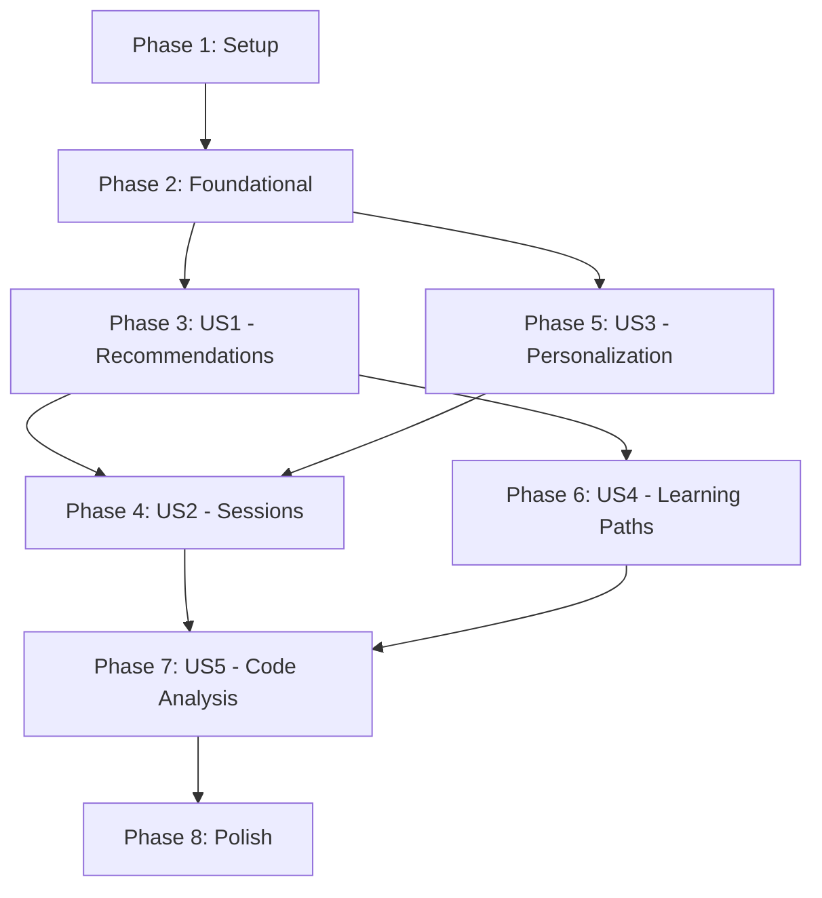

# Implementation Tasks: Intelligent Recommendations & Learning Paths

**Feature**: 002-intelligent-recommendations
**Branch**: `002-intelligent-recommendations`
**Spec**: [spec.md](./spec.md)
**Plan**: [plan.md](./plan.md)

## Task Summary

| Phase | Tasks | Parallel | Description |
|-------|-------|----------|-------------|
| Setup | 6 | 2 | Project initialization, dependencies, scraping utilities |
| Foundational | 8 | 4 | Shared models, base classes |
| US1 (P1) | 12 | 6 | Intelligent recommendations engine |
| US2 (P2) | 8 | 4 | Multi-round interactive sessions |
| US3 (P2) | 6 | 3 | Personalization and blocking |
| US4 (P3) | 8 | 4 | Learning path integration |
| US5 (P3) | 5 | 2 | Detailed code analysis |
| Polish | 4 | 2 | Documentation, final verification |

**Total**: 74 tasks (including data source and scraping tasks)

---

## Data Source Strategy

**Primary Sources** (no rate limits):
- LeetCode: https://github.com/neenza/leetcode-problems
- Codeforces: Kaggle (lborgav/codeforces-problems) or HuggingFace (DenCT/codeforces-problems-7k)
- GitHub Archive: https://www.gharchive.org/
- csdiy.wiki: Single page scrape

**API Usage** (verification only):
- GitHub: 1 request/second
- LeetCode: 1 request/2 seconds
- Codeforces: 5 requests/second

**Principle**: Use third-party datasets for bulk data, API calls only for verifying specific recommendations.

**Scraping Best Practices**:
- Use `fake_useragent` for user agent rotation
- Cache data locally before network requests
- Only fetch public metadata (no cookies/CSRF tokens)
- Support proxy configuration for IP rotation
- Enforce rate limits (default 2s between requests)

---

## Phase 1: Setup

**Goal**: Initialize project dependencies and directory structure.

### Tasks

- [x] T001 Add new dependencies to pyproject.toml (scikit-surprise>=1.1.0, lightfm>=1.17, numpy>=1.24.0, fake-useragent>=1.4.0)
- [x] T001a Add optional `[scrape]` extras to pyproject.toml with fake-useragent
- [x] T002 [P] Create services/algorithms/ directory structure at src/oss_navi/services/algorithms/
- [x] T003 [P] Create tests/unit/test_models/ directory for model tests
- [x] T004 [P] Create tests/unit/test_services/ directory for service tests
- [x] T005 Create tests/integration/ directory for integration tests

---

## Phase 2: Foundational

**Goal**: Create shared models and base classes used across all user stories.

**Blocking**: Must complete before user story phases.

### Tasks

- [x] T006 Create RecommendationMode and ModeConfig in src/oss_navi/models/recommendation.py
- [x] T007 [P] Create SkillLevel, LanguageType, LanguageProfile enums/models in src/oss_navi/models/preferences.py
- [x] T008 [P] Create BlockType enum and BlockingRule model in src/oss_navi/models/preferences.py
- [x] T009 [P] Create DomainInterest model in src/oss_navi/models/preferences.py
- [x] T010 Create UserPreferences model with methods in src/oss_navi/models/preferences.py
- [x] T011 Create Recommendation model with to_markdown() method in src/oss_navi/models/recommendation.py
- [x] T012 Create RecommendationPattern model in src/oss_navi/models/recommendation.py
- [x] T013 Create abstract BaseRecommender class in src/oss_navi/services/algorithms/base.py

---

## Phase 3: User Story 1 - Intelligent Project Recommendations (P1)

**Goal**: A developer wants to find open source projects that match their skills with relevance scores, skill gap analysis, and reasoning.

**Independent Test**: Run analysis with various language profiles (including obscure languages with no matches) and verify recommendations include scores, reasoning, and fallback suggestions.

### Tasks

#### Algorithm Implementations

- [x] T014 [P] [US1] Implement content-based filtering algorithm in src/oss_navi/services/algorithms/content_based.py
- [x] T015 [P] [US1] Implement FastRecommender class (content-based only) in src/oss_navi/services/algorithms/fast.py
- [x] T016 [US1] Implement NormalRecommender class (Surprise SVD/KNN) in src/oss_navi/services/algorithms/normal.py
- [x] T017 [US1] Implement Apriori pattern mining algorithm in src/oss_navi/services/algorithms/apriori.py
- [x] T018 [US1] Implement ThinkingRecommender class (LightFM + Apriori) in src/oss_navi/services/algorithms/thinking.py

#### Recommendation Orchestration

- [x] T019 [US1] Implement RecommenderService with mode-based algorithm selection in src/oss_navi/services/recommender.py
- [x] T020 [US1] Implement two-round language matching logic in src/oss_navi/services/recommender.py
- [x] T021 [US1] Implement relevance score computation with reasoning in src/oss_navi/services/recommender.py
- [x] T022 [US1] Implement skill gap analysis in src/oss_navi/services/recommender.py

#### CLI Integration

- [x] T023 [US1] Add --mode option to analysis command in src/oss_navi/cli.py
- [x] T024 [US1] Add --language and --learn options to analysis command in src/oss_navi/cli.py
- [x] T025 [US1] Integrate RecommenderService into analysis command in src/oss_navi/cli.py

### Tests

- [ ] T026 [US1] Write unit tests for content-based algorithm in tests/unit/test_services/test_algorithms/test_fast.py
- [ ] T027 [US1] Write unit tests for normal mode algorithm in tests/unit/test_services/test_algorithms/test_normal.py
- [ ] T028 [US1] Write unit tests for thinking mode algorithm in tests/unit/test_services/test_algorithms/test_thinking.py
- [ ] T029 [US1] Write unit tests for RecommenderService in tests/unit/test_services/test_recommender.py

---

## Phase 4: User Story 2 - Multi-Round Interactive Recommendations (P2)

**Goal**: A developer wants an interactive recommendation experience where they can provide feedback, select repositories for analysis, refine results, and control the final report.

**Independent Test**: Run analysis in interactive mode and complete a multi-round conversation that refines recommendations based on user feedback.

### Tasks

#### Session Models

- [ ] T030 [P] [US2] Create FeedbackType enum and UserFeedback model in src/oss_navi/models/session.py
- [ ] T031 [P] [US2] Create RecommendationRound model in src/oss_navi/models/session.py
- [ ] T032 [US2] Create RecommendationSession model with methods in src/oss_navi/models/session.py
- [ ] T033 [US2] Create ReportSection model with to_markdown() method in src/oss_navi/models/session.py

#### Session Service

- [ ] T034 [US2] Implement SessionService for session CRUD in src/oss_navi/services/session.py
- [ ] T035 [US2] Implement session persistence (JSON storage) in src/oss_navi/services/session.py

#### CLI Integration

- [ ] T036 [US2] Implement interactive mode prompts in src/oss_navi/cli.py
- [ ] T037 [US2] Implement report modification (delete, edit, reorder) in src/oss_navi/cli.py
- [ ] T038 [US2] Add --session option to resume sessions in src/oss_navi/cli.py

### Tests

- [ ] T039 [US2] Write unit tests for SessionService in tests/unit/test_services/test_session.py
- [ ] T040 [US2] Write unit tests for session models in tests/unit/test_models/test_session.py
- [ ] T041 [US2] Write integration tests for multi-round flow in tests/integration/test_recommendation_flow.py

---

## Phase 5: User Story 3 - Set Personalization Rules and Blocking (P2)

**Goal**: A developer wants to personalize their recommendation experience by specifying multiple languages, skill levels, and blocking rules.

**Independent Test**: Configure personalization rules and verify they are respected in subsequent recommendations.

### Tasks

- [ ] T042 [US2] Implement preferences persistence (JSON storage) in src/oss_navi/services/session.py
- [ ] T043 [US3] Add prefs set-language subcommand in src/oss_navi/cli.py
- [ ] T044 [US3] Add prefs remove-language subcommand in src/oss_navi/cli.py
- [ ] T045 [US3] Add prefs block/unblock subcommands in src/oss_navi/cli.py
- [ ] T046 [US3] Add prefs show/export/import subcommands in src/oss_navi/cli.py
- [ ] T047 [US3] Integrate blocking rules into RecommenderService in src/oss_navi/services/recommender.py

### Tests

- [ ] T048 [US3] Write unit tests for preferences models in tests/unit/test_models/test_preferences.py
- [ ] T049 [US3] Write unit tests for blocking rule evaluation in tests/unit/test_models/test_preferences.py

---

## Phase 6: User Story 4 - Discover Learning Paths (P3)

**Goal**: A developer wants recommendations connected to structured learning resources (csdiy.wiki, LeetCode, Codeforces) with automatic suggestions based on skill level.

**Independent Test**: Run analysis and verify LeetCode/Codeforces problems appear automatically based on skill level, with additional suggestions for skill gaps.

### Tasks

#### Learning Models

- [ ] T050 [P] [US4] Create ResourceType and Difficulty enums in src/oss_navi/models/learning.py
- [ ] T051 [P] [US4] Create LearningResource base model with to_markdown() in src/oss_navi/models/learning.py
- [ ] T052 [P] [US4] Create Course model (csdiy.wiki) in src/oss_navi/models/learning.py
- [ ] T053 [P] [US4] Create PracticeProblem model (LeetCode/Codeforces) in src/oss_navi/models/learning.py

#### Learning Service (Third-Party Datasets)

- [ ] T054 [US4] Implement LearningService with csdiy.wiki scraper (rate-limited 1/s) in src/oss_navi/services/learning.py
- [ ] T055 [US4] Implement LeetCode dataset loader (neenza/leetcode-problems) in src/oss_navi/services/learning.py
- [ ] T056 [US4] Implement Codeforces dataset loader (Kaggle/HuggingFace) in src/oss_navi/services/learning.py
- [ ] T056a [US4] Implement rate-limited API verification module in src/oss_navi/services/learning.py
- [ ] T056b [US4] Implement scraping utilities with fake_useragent and proxy support in src/oss_navi/utils/scraping.py
- [ ] T057 [US4] Implement automatic learning resource matching in src/oss_navi/services/learning.py

#### CLI Integration

- [ ] T058 [US4] Add sync --learning command in src/oss_navi/cli.py
- [ ] T059 [US4] Integrate learning resources into report output in src/oss_navi/cli.py

### Tests

- [ ] T060 [US4] Write unit tests for learning models in tests/unit/test_models/test_learning.py
- [ ] T061 [US4] Write unit tests for LearningService in tests/unit/test_services/test_learning.py
- [ ] T062 [US4] Write integration tests for learning APIs with mocks in tests/integration/test_learning_apis.py

---

## Phase 7: User Story 5 - Detailed Code Analysis on Demand (P3)

**Goal**: A developer wants to select specific repositories for detailed code analysis which gets added to their personalized report.

**Independent Test**: Select repositories during interactive recommendations and verify detailed analysis appears in the final report.

### Tasks

#### Analysis Models

- [ ] T063 [P] [US5] Create KeyFile and ContributionArea models in src/oss_navi/models/analysis.py
- [ ] T064 [US5] Create CodeAnalysis model with to_markdown() in src/oss_navi/models/analysis.py

#### CLI Integration

- [ ] T065 [US5] Implement detailed analysis trigger in interactive mode in src/oss_navi/cli.py
- [ ] T066 [US5] Integrate code analysis into report sections in src/oss_navi/cli.py

### Tests

- [ ] T067 [US5] Write unit tests for analysis models in tests/unit/test_models/test_analysis.py

---

## Phase 8: Polish & Cross-Cutting Concerns

**Goal**: Finalize documentation, ensure test coverage, and verify all features work together.

### Tasks

- [ ] T068 [P] Update README.md with new commands and features
- [ ] T069 [P] Update CLAUDE.md with new technology context
- [ ] T070 Verify 80% test coverage with pytest --cov
- [ ] T071 Run ruff check and fix any linting issues

---

## Dependencies



### Story Dependencies

- **US1** (Recommendations) → Independent, can start after Foundational
- **US2** (Sessions) → Depends on US1 (needs recommendations) and US3 (needs preferences)
- **US3** (Personalization) → Independent, can start after Foundational
- **US4** (Learning Paths) → Depends on US1 (needs recommendation context)
- **US5** (Code Analysis) → Depends on US2 (needs session/report context) and US4 (learning integration)

---

## Parallel Execution

### Setup Phase (2 parallel tasks)
```bash
# Can run simultaneously
T002, T003, T004  # Directory creation
```

### Foundational Phase (4 parallel tasks)
```bash
# Can run simultaneously
T007, T008, T009  # Preference model components
```

### US1 Phase (6 parallel tasks)
```bash
# Algorithm implementations can run in parallel
T014, T015  # Fast mode (content-based)
# Then sequentially:
T016  # Normal mode (depends on base)
T017, T018  # Thinking mode components
```

### US2 Phase (4 parallel tasks)
```bash
# Session models can run in parallel
T030, T031, T033
```

### US3 Phase (3 parallel tasks)
```bash
# CLI commands can run in parallel after T042
T043, T044, T045, T046
```

### US4 Phase (4 parallel tasks)
```bash
# Learning models can run in parallel
T050, T051, T052, T053
```

### US5 Phase (2 parallel tasks)
```bash
# Analysis models can run in parallel
T063, T064
```

---

## Implementation Strategy

### MVP Scope (US1 only)
- Complete Phase 1 (Setup)
- Complete Phase 2 (Foundational)
- Complete Phase 3 (US1 - Intelligent Recommendations)
- Deliver: Users can run `oss-navi analysis --mode fast|normal|thinking` and get recommendations

### Incremental Delivery
1. **v0.2.0**: US1 - Intelligent recommendations (MVP)
2. **v0.3.0**: US3 - Personalization and blocking
3. **v0.4.0**: US2 - Multi-round interactive sessions
4. **v0.5.0**: US4 - Learning path integration
5. **v0.6.0**: US5 - Detailed code analysis

---

## Verification Checklist

After completing all phases, verify:

- [ ] All 44 functional requirements from spec.md are implemented
- [ ] All 8 success criteria are measurable and met
- [ ] 80%+ test coverage achieved
- [ ] CLI commands work as documented in contracts/cli.md
- [ ] All edge cases from spec.md are handled
- [ ] Performance targets met: fast <30s, normal <90s, thinking <180s
